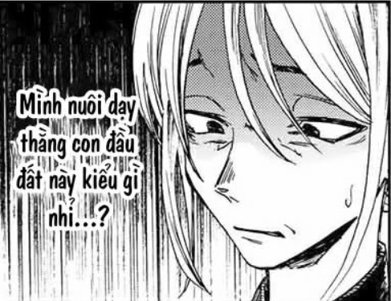

## Đề bài

*LunaDB* 

*108 pts*

*x1x_* 

*I got a dumped database file from LUNA Co., but I’m unable to read its contents. All I’ve got is the database creator’s source code. This’ll be a cracking challenge, won’t it?*

## Hướng giải

Bài này thì dễ, các bạn có thể bỏ vào GPT cho nó giải. Hoặc tự giải. Như mình thì mình sẽ bỏ vào chatGPT cho lẹ.

Trong file `main.rs` thì các bạn có thể thấy được các yếu tố sau đây:

```rust
const H_START: [u8; 4] = hex!("FF1337FF");
const H_END:   [u8; 4] = hex!("FFCAFEFF");
const D_START:   [u8; 4] = hex!("FF7270FF");
const D_END:     [u8; 4] = hex!("FFEDEDFF");
const F_START: [u8; 4] = hex!("FFDEADFF");
const F_END:   [u8; 4] = hex!("FFBEEFFF");
const SIG:    [u8; 4] = hex!("4C554E41"); 
```

Mỗi **note** trong phần dữ liệu gồm:

- ID, username, email, title, v.v.
- Một **key mask** (u64) → cho biết note này dùng key nào để mã hoá
- Dữ liệu đã mã hoá
- Timestamp và trạng thái

Trong `fn encrypt(key: &[u8;8], plaintext: &[u8])` :

```rust
fn encrypt(key: &[u8;8], plaintext: &[u8]) -> Result<Vec<u8>, String> {
    let cipher = Cipher::des_ecb();
    let mut crypter = Crypter::new(cipher, Mode::Encrypt, key, None)
        .map_err(|e| format!("Something wrong... {}", e))?;
    crypter.pad(true);
    let mut out = vec![0; plaintext.len() + cipher.block_size()];
    let mut len = crypter.update(plaintext, &mut out)
        .map_err(|e| format!("Something wrong... {}", e))?;
    len += crypter.finalize(&mut out[len..])
        .map_err(|e| format!("Something wrong... {}", e))?;
    out.truncate(len);
    Ok(out)
}
```

các bạn sẽ thấy có `Cipher::des_ecb()` và cả `crypter.pad(true)`, nghĩa là **DES ECB mode**, có padding PKCS#7

Mở `secret.lunadb` trong hex editor → thấy các marker (`FF 13 37 FF`, `FF DE AD FF`, …).

Trong phần `F_START...F_END` là nhiều key DES liên tiếp, mỗi cái dài 8 byte.

Trong phần `D_START...D_END` là các note. Mỗi note có:

- Một key mask (dạng bitmask) → thực chất chỉ bật **một bit duy nhất**, nên mỗi note chỉ dùng đúng 1 key.
- Một mảng byte đã mã hoá

Để parse file, mình code lại một số hàm cơ bản trong Python:

- Giải mã **LEB128** (cách file lưu độ dài)
- Đọc string/byte array (có prefix byte đánh dấu)
- Giải mã DES ECB (dùng `pycryptodome`)

Tới đây thì bạn có thể chuyển sang chế độ vibe-coding (hoặc có thể ngay đầu cũng được 🐧):

```python
# parse_and_decrypt_lunadb.py
import struct, re
from io import BytesIO
from Crypto.Cipher import DES

H_START = bytes([0xFF,0x13,0x37,0xFF])
H_END   = bytes([0xFF,0xCA,0xFE,0xFF])
D_START = bytes([0xFF,0x72,0x70,0xFF])
D_END   = bytes([0xFF,0xED,0xED,0xFF])
F_START = bytes([0xFF,0xDE,0xAD,0xFF])
F_END   = bytes([0xFF,0xBE,0xEF,0xFF])

def read_leb128_u64(f):
    res = 0
    shift = 0
    while True:
        b = f.read(1)
        if not b: raise EOFError("leb128 eof")
        byte = b[0]
        res |= (byte & 0x7F) << shift
        if (byte & 0x80) == 0: break
        shift += 7
    return res

def read_string(f):
    flag = f.read(1)
    if not flag: raise EOFError("eof")
    flag = flag[0]
    if flag == 0x00: return ""
    if flag in (0x0b, 0x0c):
        ln = read_leb128_u64(f)
        return f.read(ln).decode('utf-8', errors='replace')
    raise ValueError(hex(flag))

def read_bytestring(f):
    flag = f.read(1)[0]
    if flag == 0x00: return b''
    if flag == 0x0c:
        ln = read_leb128_u64(f)
        return f.read(ln)
    raise ValueError(hex(flag))

def pkcs7_unpad(b):
    if not b: return b
    pad = b[-1]
    if pad>0 and pad<=8 and b[-pad:]==bytes([pad])*pad:
        return b[:-pad]
    return b

def decrypt_des_ecb(key, ct):
    cipher = DES.new(key, DES.MODE_ECB)
    pt = cipher.decrypt(ct)
    return pkcs7_unpad(pt)

with open("secret.lunadb","rb") as fh:
    data = fh.read()

# find sections
hs = data.find(H_START); he = data.find(H_END)
ds = data.find(D_START); de = data.find(D_END)
fs = data.find(F_START); fe = data.find(F_END)

# parse keys (8-byte each)
keys_blob = data[fs+4:fe]
keys = [keys_blob[i*8:(i+1)*8] for i in range(len(keys_blob)//8)]

# parse notes
f = BytesIO(data[ds+4:de])
flags = []
while f.tell() < len(f.getvalue()):
    if f.tell()+2 > len(f.getvalue()): break
    note_id = struct.unpack("<H", f.read(2))[0]
    access = read_string(f)
    first = read_string(f); last = read_string(f); email = read_string(f)
    title = read_string(f)
    key_field = struct.unpack("<Q", f.read(8))[0]
    enc = read_bytestring(f)
    created = struct.unpack("<Q", f.read(8))[0]
    modt = struct.unpack("<Q", f.read(8))[0]
    suspended = f.read(1)[0]
    if enc and key_field != 0xFFFFFFFFFFFFFFFF and key_field != 0:
        # only handle single-bit masks
        if (key_field & (key_field-1)) == 0:
            idx = key_field.bit_length() - 1
            if idx < len(keys):
                pt = decrypt_des_ecb(keys[idx], enc)
                try:
                    txt = pt.decode('utf-8',errors='ignore')
                except:
                    txt = ""
                if re.search(r'flag|FLAG|\{', txt, re.I):
                    print("Note id", note_id, "key idx", idx, "plaintext:", txt)
```

Sau khi chạy, chúng ta sẽ thu được flag:

```
HOLACTF{4_c0Ol_Cu5t0m_f1lE_5truC7}
```

## Lời kết

Bài này dùng ChatGPT cái là ra :D

Với lại, DES/ECB vốn yếu, nên là parse rồi decrypt là ra hẹ hẹ hẹ

Vibe/10


