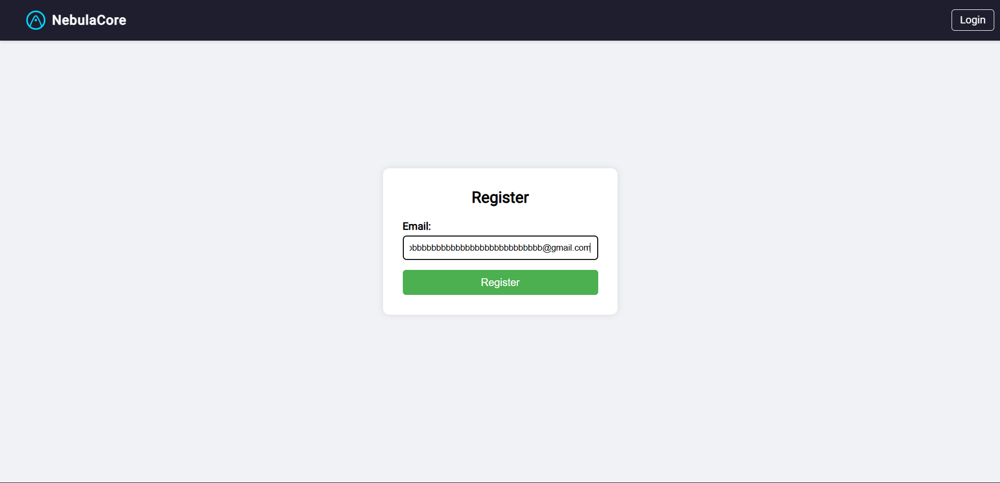

## The Challenge

*passwordless (100pts)*

*by Ciaran*

*Description*

*Didn't have time to implement the email sending feature but that's ok, the site is 100% secure if nobody knows their password to sign in!*

*http://passwordless.chal.imaginaryctf.org (link might expired)*

## Solution Approach

Okay, this challenge is quite interesting. We need to find a way to log in without knowing the password (truly "Passwordless"), because the feature to send the password via email hasn't been set up. Generally, this vulnerability is a bit unrealistic and quite rare (maybe you'd see it from newcomers to web dev who haven't learned backend yet :D). Well, it's a challenge, so we have to solve it~

This challenge provides an `index.js` file for review, but it's too long to include here. Maybe later I'll add attachments so you can revisit this challenge (if I have free storage).

Okay, so here are the key factors I discovered:

- **Email Normalization:** The web application uses the `normalize-email` library to normalize the email address provided by the user. For example, an email like `user.name+alias@gmail.com` will be normalized to `username@gmail.com`. This normalized email is used as the unique identifier for the user in the database.
- **Password Creation Logic:** During registration, a temporary password is created by concatenating the **original (unnormalized) email** entered by the user with a random 32-character hexadecimal string. This password is then hashed using `bcrypt` and saved to the database. The source code that reveals this is:

```js
const initialPassword = req.body.email + crypto.randomBytes(16).toString('hex')
```

→ The weakness of the `bcrypt` algorithm is that it truncates the input password at a length of 71 characters. Any characters after the 71st character are ignored during both the hash creation and password comparison processes. At this point, you probably know what kind of shenanigans we're about to pull :D

Yep, we can register with a very long email address (over 71 characters), and it will be automatically normalized to a shorter one. Since the password is created from this super-long original email, the part after the 71st character will be truncated and ignored by `bcrypt`, so... you know what that means 🐧

So, let's head over to the account registration page. In the email field, enter:

```
exploit+bbbbbbbbbbbbbbbbbbbbbbbbbbbbbbbbbbbbbbbbbbbbbbbbbbbbbbbbbbbb@gmail.com
```

Yep, and then just submit it~



Then, go back to the login page:

- In the email field, enter: `exploit@gmail.com`
- In the password field, enter:

```
exploit+bbbbbbbbbbbbbbbbbbbbbbbbbbbbbbbbbbbbbbbbbbbbbbbbbbbbbbbbbbbb@gmail.co
```

And just like that, omedetou~

You're logged in :D

And the flag is:

```
ictf{8ee2ebc4085927c0dc85f07303354a05}
```

## Conclusion

Nice challenge, easy/10


