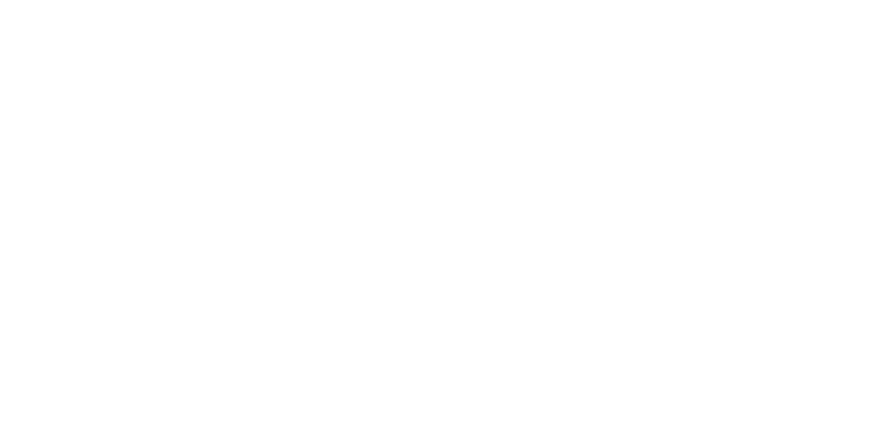
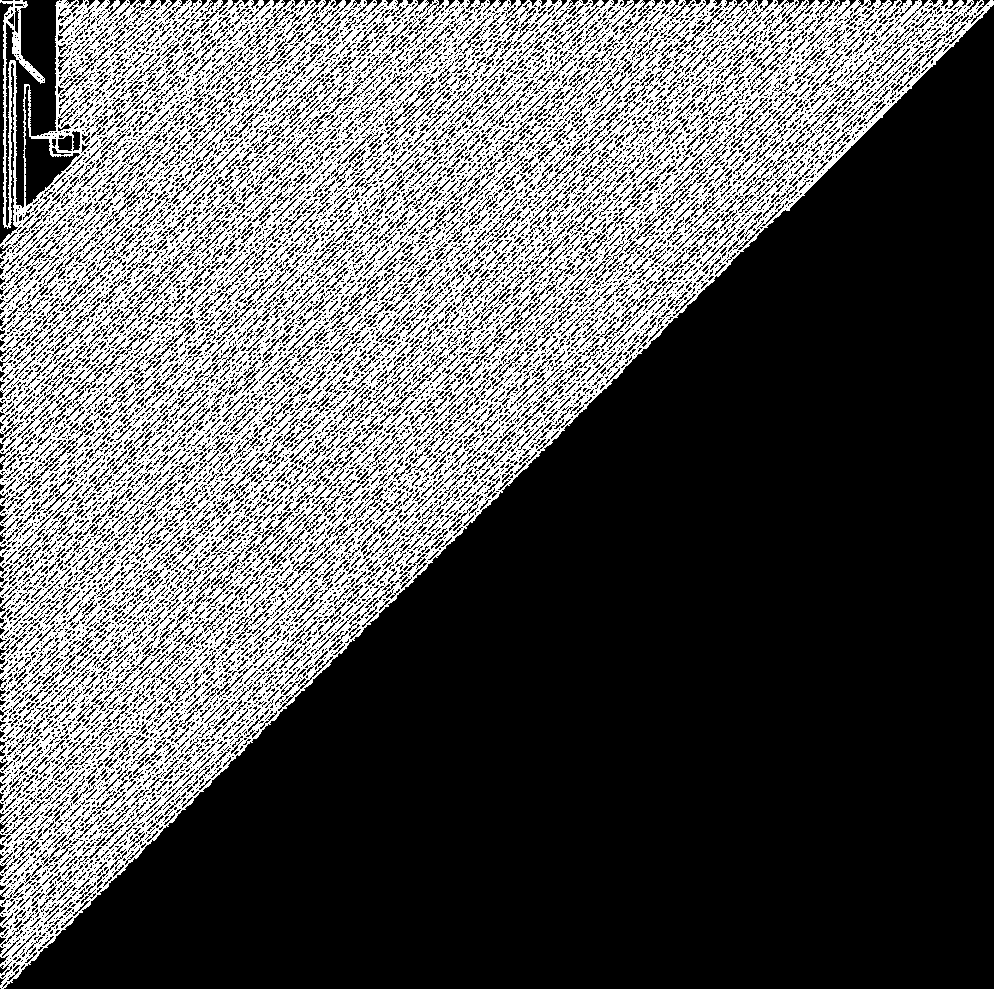
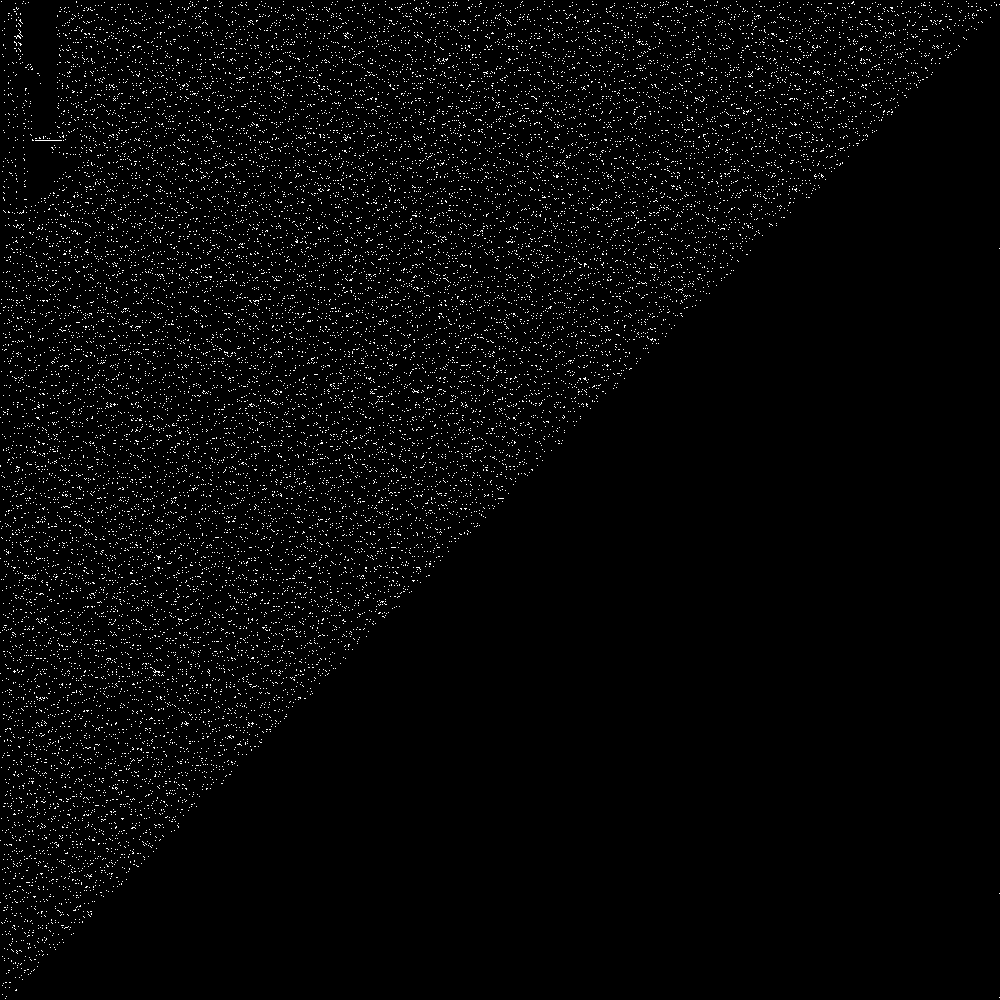
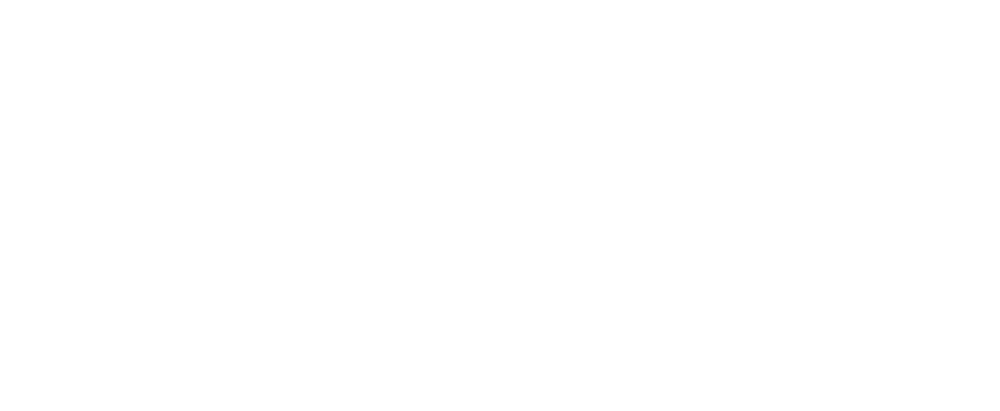
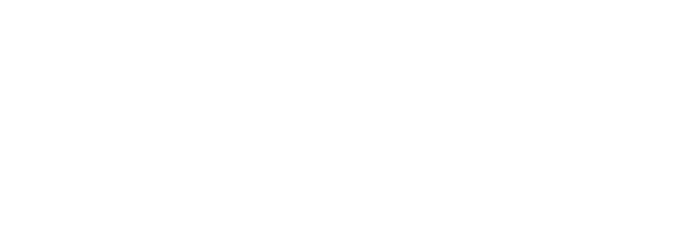

## The Challenge

*glyphs*

*Description*

*Sparkle has reserved the stage for one final performance.*

*Every mask hides another stage, and every actor moves with the whole cast. Find the face that earns the audience's applause.*

The attachment only contains one file named `glyphs`. Running `file` shows that it is a normal Linux binary from the outside:

```text
glyphs: ELF 64-bit LSB pie executable, x86-64, dynamically linked, stripped
```

However, it does not behave like a normal flag checker. If we pass a random argument, the output is just:

```bash
$ ./glyphs test
nope
```

There is no obvious `strcmp`, no readable flag in `strings`, and even the final output strings are not useful as static clues. At this point, the challenge already looks like the author did not want us to reverse a small comparison loop. The real checker is hidden behind another representation.

The final flag is:

```text
uiuctf{oRig1naLLy_7HiS_W4s_gonna_be_moR3_FoCU53d_0N_the_GLYpH_p4rt_BU7_1_f3LL_d0WN_7h3_l4mbD4_c4lc_R4bb1t_H0Le_s0_H3r3_w3_4r3_noW_41n7_7H47_gr3at}
```

This writeup explains how I recovered it, including the slightly funny part: the binary does not actually constrain every byte of the final flag.



## The Walkthrough

### First look

The binary is quite large for a rev challenge:

```text
$ ls -lh glyphs
24M glyphs

$ sha256sum glyphs
7727129104630c5c984a68aae449005c206c14a7bbbdf09636d5074145f7c9a0  glyphs
```

The main function is not the interesting part. It only checks whether an argument exists, then sends `argv[1]` into a huge routine. The output is eventually copied from a mutable buffer. So, instead of searching for a hardcoded `good` or `nope`, I started looking for the structure that creates those values at runtime.

The first big clue is the file size. Most of the binary is not normal code. There is a huge packed bitmap beginning around file offset `0xa030`. By following the bounds checks in the walking routine, the dimensions can be recovered as:

```text
width  = 13915
height = 13843
bits   = 13915 * 13843 = 192625345
bytes  = ceil(bits / 32) * 4 = 24078172
```

Right after the bitmap, there is a direction table:

```text
( 1,  0)  E
( 1,  1)  SE
( 0,  1)  S
(-1,  1)  SW
(-1,  0)  W
(-1, -1)  NW
( 0, -1)  N
( 1, -1)  NE
```

So the binary is carrying a huge two-dimensional drawing, and the program walks through that drawing as if it were code. Rendering a small part of the bitmap makes the idea much clearer:



A direct crop also shows that the data is structured, not random:



At this stage, I did not try to manually understand the whole picture. That would be painful and probably unnecessary. A better plan is to instrument the VM and dump the higher-level objects it builds.

### The glyph VM is building lambda terms

The VM stores values as 24-byte records. After tracing the helper functions, the records behave like a small term language. The important tags look like this:

```text
tag 1  literal / integer-like value
tag 2  variable-like leaf
tag 3  binder / lambda abstraction
tag 4  application / binary node
```

The exact names are not very important. What matters is the behavior: the program is building lambda-calculus-style terms and then normalizing them. There is even binder-aware substitution/renaming logic, which is a strong sign that these are not just random binary trees.

The input also enters this VM world. Bytes from `argv[1]` are copied into a 24-byte-stride memory area. Later, the VM computes the internal address `1458`; because the VM memory starts 16 records after the base, this reaches record index `16 + 1458 = 1474`, exactly where the copied argument bytes begin.

So the user input is not checked directly. It is converted into VM records, then compared inside the generated term system.

### Finding the final selector

Near the end of the program, two integer constants are constructed:

```text
0x65706f6e  -> little-endian bytes 6e 6f 70 65 -> "nope"
0x646f6f67  -> little-endian bytes 67 6f 6f 64 -> "good"
```

Dumping the term immediately before the final normalization gives the most important structure of the whole challenge:

```text
((((CHECKER TARGET) USER_INPUT) "nope") "good")
```



This is the moment where the challenge becomes much more manageable. We do not need to understand every stroke in the giant glyph drawing. We only need to understand three terms:

- `CHECKER`, the fixed comparison function;
- `TARGET`, the fixed expected value;
- `USER_INPUT`, the value created from our argument.

To confirm that this interpretation was not just a guess, I patched one pointer at the final normalizer call. I replaced the `USER_INPUT` operand with the already-present `TARGET` operand. With a wrong input like `test`, the patched binary printed:

```text
good
```

That proves the final term is really selecting the branch based on whether the generated input tree equals the target tree.

### Understanding the checker

The fixed `CHECKER` term is a recursive structural equality function over Church-encoded binary trees.

The outer tree nodes are Church-encoded 4-tuples:

```text
TUP4[0] = empty marker
TUP4[1] = key
TUP4[2] = left child
TUP4[3] = right child
```

The keys inside those tree nodes are Church-encoded ternary lists:

```text
TUP3[0] = end marker
TUP3[1] = ternary digit selector
TUP3[2] = tail
```

The key comparator walks the ternary list and checks every digit. There is a small 3-by-3 mismatch matrix: equal digits continue the comparison, while different digits select the false path. Once this is decoded, the checker is not magical anymore. It is basically equality over encoded trees.

The useful consequence is that `TARGET` can be decoded without solving the entire lambda calculus by hand. We can project out tree fields, read the ternary streams, and convert them back into integers.

### Ternary streams and the predecessor trick

For known input bytes, the preprocessing stage writes transformed integer values. Some examples are:

```text
f('a') = 0x3c430dd273a
f('T') = 0x8464c4c7e
f('t') = 0x7d99f5d559
f('}') = 0xe23670024e
```

When those integers are converted into the Church-encoded key format, the selector stream matches the normal base-3 representation, most-significant trit first. For example:

```text
f('a') = 0x3c430dd273a
base3   = 112122220002010201000020111
stream  = 112122220002010201000020111
```

There is one small twist. Before the comparison, the normalized tree applies a successor to the ternary stream, but the head of the stream is treated as the least-significant trit:

```text
succ(0 :: xs) = 1 :: xs
succ(1 :: xs) = 2 :: xs
succ(2 :: xs) = 0 :: succ(xs)
```

Therefore, to decode a `TARGET` key, I applied the inverse operation:

```text
pred(1 :: xs) = 0 :: xs
pred(2 :: xs) = 1 :: xs
pred(0 :: xs) = 2 :: pred(xs)
```

After applying this predecessor to all unique target keys, every key mapped cleanly to printable preprocessing values:

```text
52 unique keys -> printable ASCII pairs
 1 unique key  -> singleton "}"
 0 unmatched keys
```

At this point, I had the set of chunks that appear in the flag. What I still did not have was the original order.

The unordered pair set looked like this:

```text
53, oR, _d, _m, Fo, t_, 3_, _H, CU, oW, _t, 47, W4, mb,
0L, _4, 4l, R4, _7, Ly, 7h, 4r, at, _g, BU, _p, D4, he,
Hi, 1n, nn, _c, 7_, ig, f3, be, _G, s_, _n, N_, r3, d_,
w3, 0W, go, 7H, c_, 0N, aL, a_, e_, ct
```

### Recovering the input layout

The tree shape depends on the input length. Instead of fully reducing the whole recursive structure, I queried the tree through finite Church projections: ask for `TUP4[0]`, `TUP4[1]`, `TUP4[2]`, and `TUP4[3]` only when needed.

Comparing controlled input trees against the target tree gave one exact length:

```text
input length = 146
```

For this length, the preprocessing layout is:

```text
byte 0 is ignored
positions (1,2), (3,4), ..., (143,144) become 72 pair chunks
position 145 becomes the final singleton chunk
```



This is already a strange detail: the first byte does not affect the final check for this length.

### Recovering the order

To recover the original order, I generated a controlled 146-byte input where all 72 pair chunks were distinct and the final singleton was distinct as well. Then I dumped the normalized `USER_INPUT` tree for that probe.

Because every probe chunk was unique, each visible tree path could be mapped back to exactly one original chunk index:

```text
tree path -> normalized key -> predecessor -> raw transform -> original chunk index
```

Applying the resulting path-to-chunk permutation to the real target labels produced this constrained template:

```text
???ct??oRig1naLLy_7Hi??W4s_gonna_be_moR3_FoCU53d_0N_the_G????_p4rt_BU7_??f3??_d0WN_7h3_??mbD4_c4lc_R4????_H0Le_??_H??3_w3??r3_noW_4??7_7H47_g??at}
```

The `?` characters are important. They are not bytes I simply failed to reverse. They are not checked by the final tree.

More precisely, only 58 of the 73 preprocessing chunks appear in the normalized final tree. The missing pair chunk indices are:

```text
[0, 2, 10, 28, 29, 35, 37, 43, 50, 51, 55, 57, 60, 65, 70]
```

So the number of unconstrained bytes is:

```text
1 ignored first byte + 15 missing pairs * 2 bytes = 31 unconstrained bytes
```

To verify this, I replaced all the missing pairs with `AA` and the ignored first byte with `X`:

```text
XAActAAoRig1naLLy_7HiAAW4s_gonna_be_moR3_FoCU53d_0N_the_GAAAA_p4rt_BU7_AAf3AA_d0WN_7h3_AAmbD4_c4lc_R4AAAA_H0Le_AA_HAA3_w3AAr3_noW_4AA7_7H47_gAAat}
```

The original unmodified binary accepted it:

```bash
$ ./glyphs 'XAActAAoRig1naLLy_7HiAAW4s_gonna_be_moR3_FoCU53d_0N_the_GAAAA_p4rt_BU7_AAf3AA_d0WN_7h3_AAmbD4_c4lc_R4AAAA_H0Le_AA_HAA3_w3AAr3_noW_4AA7_7H47_gAAat}'
good
```

This is why I had to be careful not to claim that every single character was mechanically recovered from the checker. The checker recovers a constrained template, and the missing characters are filled from the intended sentence.

### Filling the intended sentence

The constrained template is clearly leetspeak English. Filling the missing pieces naturally gives:

```text
uiuctf{oRig1naLLy_7HiS_W4s_gonna_be_moR3_FoCU53d_0N_the_GLYpH_p4rt_BU7_1_f3LL_d0WN_7h3_l4mbD4_c4lc_R4bb1t_H0Le_s0_H3r3_w3_4r3_noW_41n7_7H47_gr3at}
```

The sentence reads approximately:

```text
Originally this was gonna be more focused on the glyph part,
but I fell down the lambda calc rabbit hole,
so here we are now, ain't that great.
```

Finally, the reconstructed flag is accepted by the original binary:

```bash
$ ./glyphs 'uiuctf{oRig1naLLy_7HiS_W4s_gonna_be_moR3_FoCU53d_0N_the_GLYpH_p4rt_BU7_1_f3LL_d0WN_7h3_l4mbD4_c4lc_R4bb1t_H0Le_s0_H3r3_w3_4r3_noW_41n7_7H47_gr3at}'
good
```

## Final Exploit

The full reversing process used instrumentation, target-term dumps, and controlled probes. Once the facts above are known, the final verification script is small:

```python
#!/usr/bin/env python3
import subprocess

flag = "uiuctf{oRig1naLLy_7HiS_W4s_gonna_be_moR3_FoCU53d_0N_the_GLYpH_p4rt_BU7_1_f3LL_d0WN_7h3_l4mbD4_c4lc_R4bb1t_H0Le_s0_H3r3_w3_4r3_noW_41n7_7H47_gr3at}"

out = subprocess.check_output(["./glyphs", flag], timeout=5)
print(len(flag), out.decode().strip())
```

Output:

```text
146 good
```

I also kept the arbitrary-filler accepted input as a sanity check:

```python
#!/usr/bin/env python3
import subprocess

candidates = [
    "uiuctf{oRig1naLLy_7HiS_W4s_gonna_be_moR3_FoCU53d_0N_the_GLYpH_p4rt_BU7_1_f3LL_d0WN_7h3_l4mbD4_c4lc_R4bb1t_H0Le_s0_H3r3_w3_4r3_noW_41n7_7H47_gr3at}",
    "XAActAAoRig1naLLy_7HiAAW4s_gonna_be_moR3_FoCU53d_0N_the_GAAAA_p4rt_BU7_AAf3AA_d0WN_7h3_AAmbD4_c4lc_R4AAAA_H0Le_AA_HAA3_w3AAr3_noW_4AA7_7H47_gAAat}",
]

for candidate in candidates:
    out = subprocess.check_output(["./glyphs", candidate], timeout=5)
    print(len(candidate), out.decode().strip())
```

Output:

```text
146 good
146 good
```

This second result proves that the unknown positions in the template are genuinely unconstrained by the final checker.

## Why This Works

The challenge looks scary because the surface layer is a 24 MiB stripped ELF with a giant glyph bitmap and a custom 2D VM. But after instrumentation, the core becomes much cleaner:

```text
glyph bitmap
  ↓ walked by 2D VM
24-byte lambda-term records
  ↓ final normalizer call
((((CHECKER TARGET) USER_INPUT) "nope") "good")
  ↓ decode CHECKER
structural equality over Church-encoded binary trees
  ↓ decode keys
ternary digit streams / base-3 integers
  ↓ invert stream successor
printable preprocessing chunks
  ↓ recover tree path order with a unique probe
constrained flag template
  ↓ fill unchecked bytes from the intended sentence
accepted flag
```

The most important observations were:

- the large data blob is a packed bitmap plus an 8-direction movement table;
- the VM builds lambda-calculus terms instead of doing a direct byte comparison;
- the final term separates cleanly into `CHECKER`, `TARGET`, and `USER_INPUT`;
- replacing `USER_INPUT` with `TARGET` dynamically changes a wrong input from `nope` to `good`;
- the checker is recursive structural equality over Church-encoded trees;
- target keys decode into printable pair/singleton chunks;
- a unique-chunk probe reveals the original chunk order;
- 31 bytes are not checked, so the final intended text still needs the sentence reconstruction step.

## Final Words

This was a very cool reversing challenge. At first it looked like a visual VM problem because of the giant bitmap, but the real rabbit hole was the lambda-calculus machinery behind the drawing.

My favorite part is that the flag itself jokes about the solve path. It says the challenge was originally going to be more focused on glyphs, but then it fell down the lambda calculus rabbit hole. Honestly, that is exactly what happened while reversing it.

```text
uiuctf{oRig1naLLy_7HiS_W4s_gonna_be_moR3_FoCU53d_0N_the_GLYpH_p4rt_BU7_1_f3LL_d0WN_7h3_l4mbD4_c4lc_R4bb1t_H0Le_s0_H3r3_w3_4r3_noW_41n7_7H47_gr3at}
```

「読めるわけがない 」

